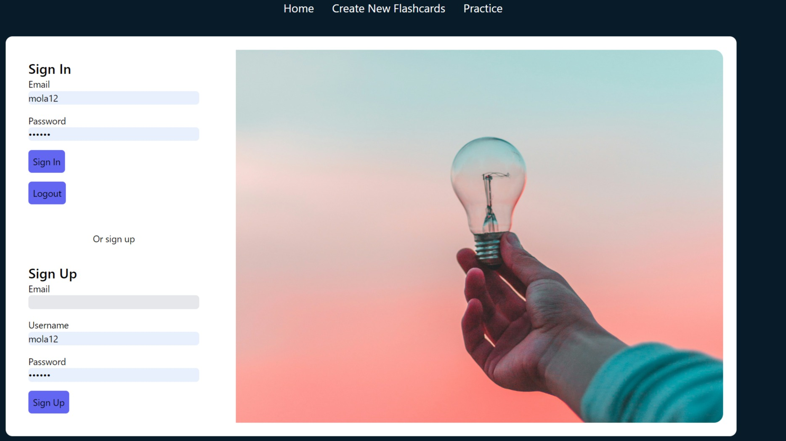

# Flash Card APP

Flashcard App Description

The Flashcard App is an interactive and user-friendly web application designed to help users create, manage, and practice flashcards for efficient learning and memory retention. Users can sign up, log in, and create custom flashcards with questions and answers, which they can then review and practice to enhance their study sessions. The app provides an intuitive interface for navigating through flashcards, flipping them to reveal answers, and progressing through their study sets.

## Technologies Used

### Frontend

React: The app's user interface is built using React, a popular JavaScript library for building dynamic and responsive web applications. React's component-based architecture allows for efficient UI rendering and state management.
Tailwind CSS: For styling, the app utilizes Tailwind CSS, a utility-first CSS framework. Tailwind provides a wide range of pre-designed classes, enabling quick and consistent styling across the application.
Apollo Client: Apollo Client is used to manage GraphQL queries and mutations from the frontend. It provides a simple and flexible way to interact with the GraphQL server, handling data fetching and caching efficiently.
React Router: React Router is employed for client-side routing, allowing users to navigate between different pages and components within the app seamlessly.

### Backend

Node.js: The backend of the app is powered by Node.js, a JavaScript runtime built on Chrome's V8 engine. Node.js allows for building scalable and high-performance server-side applications.

Express: Express is a minimal and flexible Node.js web application framework used to create the server and API endpoints for the app. It handles HTTP requests and responses, routing, and middleware.

MongoDB: MongoDB, a NoSQL database, is used to store user data and flashcards. It provides a flexible schema design and scalable performance, making it suitable for handling dynamic and unstructured data.

Mongoose: Mongoose is an ODM (Object Data Modeling) library for MongoDB and Node.js. It provides a straightforward, schema-based solution to model application data and simplifies interactions with the database.

GraphQL: The app's backend API is built using GraphQL, a query language for APIs. GraphQL enables clients to request specific data, reducing over-fetching and under-fetching issues common in REST APIs.

Apollo Server: Apollo Server is used to build the GraphQL API on the server side. It integrates seamlessly with Express and provides tools for defining the schema, resolvers, and middleware for authentication and authorization.

Authentication
JWT (JSON Web Tokens): Authentication is implemented using JWTs. Users receive a token upon successful login, which is stored on the client side and used to authenticate subsequent requests. The token ensures secure communication between the client and server.

## Table of Contents

- [Features](#features)
- [Link-to-Webpage](#Link-to-Webpage)
- [Appearance](#Appearance)
- [About-Developer](#About-developer)
- 

## About-developer

Hello! I'm Molaligne (Mola) Dafa, a dedicated web developer with a passion for reading, understanding how things work, and creating solutions that make the world a better place. My journey into web development stems from a deep curiosity and a strong desire to develop impactful and innovative solutions.

I hold a Full Stack Web Development Certificate from the University of Adelaide. My expertise spans modern web technologies, including Express.js, Node.js, React.js, Tailwind CSS, MySQL/NoSQL, and MongoDB.

## Features

- ** Account create
- ** Custom cardshighlighted.
- ** Automatic shuffle

  
## Link-to-Webpage
- https://github.com/Mola90/Flash-Card-App
LiveSite: https://finalprojectflashcard-41e0f26c11e4.herokuapp.com/ 

## Appearance

The following image demonstrates the page's appearance
